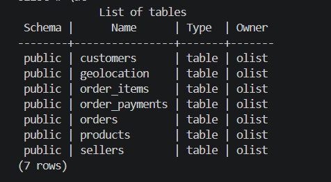

# Task 1 — Olist Database Setup

## 1. Understanding the Dataset

The Brazilian E-Commerce Public Dataset by Olist was used for this task.

The dataset contains multiple related tables representing different parts
of the e-commerce system, including customers, orders, products, sellers,
payments, order items, and geolocation data.

The main goal of this task was to understand the dataset structure,
load the data into a relational database, and verify the relationships
between the tables.

### Main Tables

- customers
- orders
- order_items
- order_payments
- products
- sellers
- geolocation

---

## 2. Loading the Data

PostgreSQL was used as the relational database.

The Olist dataset was loaded into the database, and the following seven
tables were created successfully:

- customers
- geolocation
- order_items
- order_payments
- orders
- products
- sellers

The database was checked using PostgreSQL's `\dt` command to verify that
the tables were created successfully.



### Data Validation

The number of records in the `customers` table was checked:

```sql
SELECT COUNT(*) FROM customers;

Result:

99,441 records

The number of records in the orders table was also checked:

SELECT COUNT(*) FROM orders;

Result:

99,441 records

3. Testing the Relationships

To verify that the relationships between the tables were working correctly,
a JOIN was performed between the orders and customers tables using
the customer_id field.

SELECT
    o.order_id,
    o.customer_id,
    c.customer_unique_id
FROM orders o
JOIN customers c
    ON o.customer_id = c.customer_id
LIMIT 10;

The query successfully returned matching records from both tables.

To further validate the relationship, the total number of matching records
was checked:

SELECT COUNT(*)
FROM orders o
JOIN customers c
    ON o.customer_id = c.customer_id;

Result:

99,441 records

This confirms that all records in the orders table had a matching
customer_id in the customers table.

4. Conclusion

The Olist dataset was successfully loaded into PostgreSQL.

The database tables were verified, the data was validated using record
counts, and the relationship between the orders and customers tables
was successfully tested using SQL JOIN queries.

The database is ready for further analysis and future MLOps tasks.


### 2. بعد ما تحفظيه

لا نعمل PDF بإيدنا هسا.

ابعتيلي **صورة من الـTask الأصلي أو النص الكامل للخطوات الثلاث** مرة ثانية، وأنا أراجع التقرير مقابل المطلوب **قبل التسليم**.

خصوصًا لأننا بدنا نتأكد إن كل نقطة طلبها المدرب موجودة، وما نحط في التقرير ادعاء مثل Docker أو شيء ما وثقناه فعليًا.
اعمل الملف كامل  و ابعثلي اياه

تفضلي، عملتلك الملف كامل ومرتب:

تحميل Task 1 Report

حطيه داخل مشروعك هنا:

OLIST-MLOPS/
└── report/
    └── Task_1_Report.md

وبعدها بنضيفه للـGitHub ونعمل commit منفصل للتقرير. 

Task_1_Report.md
Document

Task_1_Report.md
Task 1 — Olist Database Setup
1. Understanding the Dataset

The Brazilian E-Commerce Public Dataset by Olist was used for this task.

The dataset contains multiple related tables representing different parts of the e-commerce system, including customers, orders, products, sellers, payments, order items, and geolocation data.

The main goal of this task was to understand the dataset structure, load the data into a relational database, and verify the relationships between the tables.

Main Tables
customers
orders
order_items
order_payments
products
sellers
geolocation
2. Loading the Data

PostgreSQL was used as the relational database.

The Olist dataset was loaded into the database, and the following seven tables were created successfully:

customers
geolocation
order_items
order_payments
orders
products
sellers

The database was checked using PostgreSQL's \dt command to verify that the tables were created successfully.

Evidence: screenshots/01_tables.png

Data Validation

The number of records in the customers table was checked using:

SELECT COUNT(*) FROM customers;

Result:

99,441 records

Evidence: screenshots/02_customers_count.png

The number of records in the orders table was also checked using:

SELECT COUNT(*) FROM orders;

Result:

99,441 records

Evidence: screenshots/03_orders_count.png

3. Testing the Relationships

To verify that the relationship between the orders and customers tables was working correctly, a JOIN was performed using the customer_id field.

SELECT
    o.order_id,
    o.customer_id,
    c.customer_unique_id
FROM orders o
JOIN customers c
    ON o.customer_id = c.customer_id
LIMIT 10;

The query successfully returned matching records from both tables.

Evidence: screenshots/04_orders_customers_join.png

To further validate the relationship, the total number of matching records was checked:

SELECT COUNT(*)
FROM orders o
JOIN customers c
    ON o.customer_id = c.customer_id;

Result:

99,441 records

This confirms that all records in the orders table had a matching customer_id in the customers table.

4. Conclusion

The Olist dataset was successfully loaded into PostgreSQL.

The database tables were verified, the data was validated using record counts, and the relationship between the orders and customers tables was successfully tested using SQL JOIN queries.

The database is ready for further analysis and future MLOps tasks.

Task_1_Report.md
Task 1 — Olist Database Setup
1. Understanding the Dataset

The Brazilian E-Commerce Public Dataset by Olist was used for this task.

The dataset contains multiple related tables representing different parts of the e-commerce system, including customers, orders, products, sellers, payments, order items, and geolocation data.

The main goal of this task was to understand the dataset structure, load the data into a relational database, and verify the relationships between the tables.

Main Tables
customers
orders
order_items
order_payments
products
sellers
geolocation
2. Loading the Data

PostgreSQL was used as the relational database.

The Olist dataset was loaded into the database, and the following seven tables were created successfully:

customers
geolocation
order_items
order_payments
orders
products
sellers

The database was checked using PostgreSQL's \dt command to verify that the tables were created successfully.

Evidence: screenshots/01_tables.png

Data Validation

The number of records in the customers table was checked using:

SELECT COUNT(*) FROM customers;

Result:

99,441 records

Evidence: screenshots/02_customers_count.png

The number of records in the orders table was also checked using:

SELECT COUNT(*) FROM orders;

Result:

99,441 records

Evidence: screenshots/03_orders_count.png

3. Testing the Relationships

To verify that the relationship between the orders and customers tables was working correctly, a JOIN was performed using the customer_id field.

SELECT
    o.order_id,
    o.customer_id,
    c.customer_unique_id
FROM orders o
JOIN customers c
    ON o.customer_id = c.customer_id
LIMIT 10;

The query successfully returned matching records from both tables.

Evidence: screenshots/04_orders_customers_join.png

To further validate the relationship, the total number of matching records was checked:

SELECT COUNT(*)
FROM orders o
JOIN customers c
    ON o.customer_id = c.customer_id;

Result:

99,441 records

This confirms that all records in the orders table had a matching customer_id in the customers table.

4. Conclusion

The Olist dataset was successfully loaded into PostgreSQL.

The database tables were verified, the data was validated using record counts, and the relationship between the orders and customers tables was successfully tested using SQL JOIN queries.

The database is ready for further analysis and future MLOps tasks.